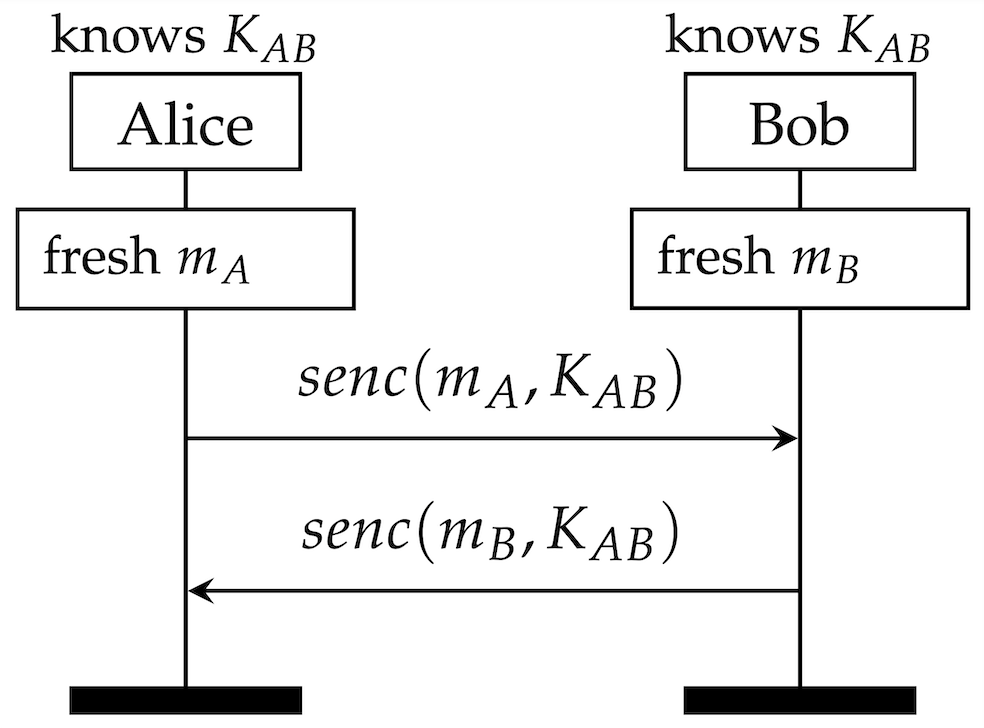

## Getting started with Tamarin

We start by considering a very simple protocol: Alice and Bob want to exchange two random numbers (mA and mB respectively) secretly. 
In the following exercises, we will consider different versions of this protocol: different abstraction layers, different security properties and different adversarial models.

## Exercise 2.1

In this exercise we just assume that Alice and Bob _already have_ a shared fresh symmetric secret key. Hence they can easily send each other encrypted messages:

### Protocol Model
Using the skeleton file `Protocol1.spthy` and the hints below, model this protocol. 
* Use Tamarin’s rewrite rules to model the setup of the shared symmetric key between Alice and Bob. We do **not** allow either party to get compromised and reveal the key.
* Use Tamarin’s built-in `symmetric-encryption` theory for the encryption function. It defines the function symbols `senc/2` and `sdec/2`, which are related by the equation `sdec(senc(m,k),k) = m`. This theory can be used in a Tamarin file by adding the line: 
    `builtins:  symmetric-encryption`
at the beginning of your Tamarin theory. 
The skeleton file `Protocol1.spthy` already includes this built-in theory. 

### Executability Lemma

To make sure your model behaves as expected, always write some lemmas that guarantee that the parties executing it can complete all their steps.
This helps you to detect typos and modelling errors, which may make some of the rewriting rules that model the protocol impossible to execute.

The skeleton file already includes such a lemma, `lemma executable`, stating that Alice can finish her run of the protocol, sending message _mA_ and receiving message _mB_ from Bob, and Bob can finished his run, sending the message _mB_ and receiving _mA_ from Alice.

* At the action facts `FinishedA(..)` (for Alice) or `FinishedB(..)` (for Bob) in your model. In which rules should they be added? 

Once you have implemented the model and added the necessary action facts, load the interactive mode of Tamarin and verify your executability lemma.

Tamarin gives you a graphical output when it finds an execution. Try relating this graph to your model. Can you make sense of it?

### Security Properties: Secrecy

The protocol should guarantee that no party other than Alice and Bob can obtain _mA_ or _mB_.

* Add the following two action facts to the appropriate rules:
  * `SecretA($A, $B, ma)`: Indicates that at this point Alice (agent $A) believes ma to be secret between her and Bob (agent $B).
  * `SecretB($B, $A, mb)`: Indicates that at this point Bob (agent $B) believes mb to be secret between him and Alice (agent $A).

* Write a lemma `lemma secrecyA` stating that when Alice finishes her role, exchanging a message _mA_ (apparently) with Bob, then the message is a secret, in that it is only known by Alice and Bob, but no other agents, in particular the intruder.

* Write an analogous `lemma secrecyB`, referring to the message _mB_ exchanged by Bob at the end of his role. 

Once you have written them, load the interactive mode of Tamarin and try verifying both lemmas. Do they hold? What would you expect?