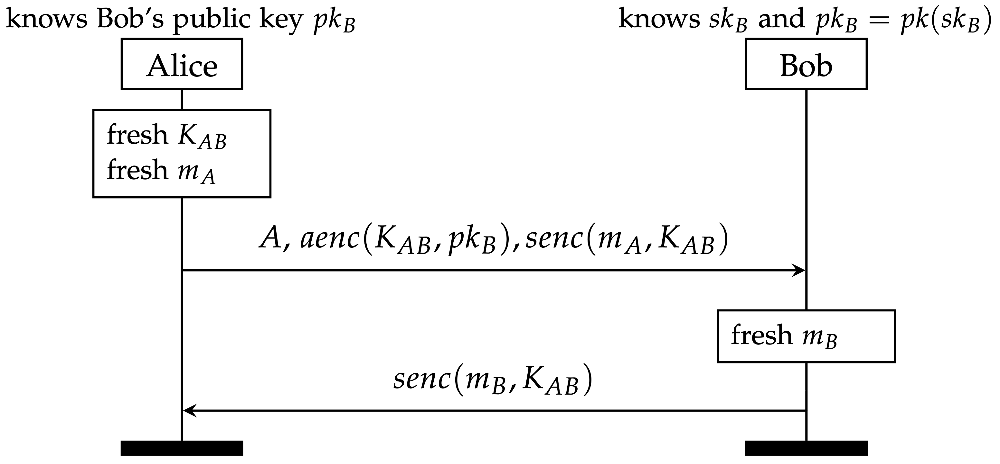

## Exercise 2.2: Public Key Infrastructure

In the previous task, we abstracted away (via a rule) how Alice and Bob share a symmetric key. In real life, this is not an easy problem. In this task, we assume that a public key infrastructure (PKI) is available. 

We consider the straightforward idea where Alice chooses a symmetric key _KAB_ and sends it to Bob, encrypting it with his public key. This is known as hybrid encryption.

#### Useful Tamarin built-ins

Note that Tamarin already has a built-in theory asymmetric-encryption that models a public key encryption scheme. It defines the function symbols `aenc/2`, `adec/2`, and `pk/1`, which are related by the equation
`adec(aenc(m, pk(sk)), sk) = m`.

### Protocol Model

Using the skeleton file `Protocol2.spthy` and the hints below, model this protocol. 

* To be able to use the asymmetric encryption mechanism, protocol agents need to generate key pairs. Write a rule that allows an agent to generate a private/public key pair. 
For now, we do not allow agents to get compromised and reveal their secret keys.

* Model the rest of the protocol. 

* Write an executability lemma to verify that your model is actually executable: add action facts accordingly and make sure that Tamarin returns the expected protocol run (the graph in interactive mode). 

### Security Properties: Secrecy

As in the previous, exercise, this protocol should guarantee that no party other than Alice and Bob can obtain _mA_ or _mB_.

* Again, add the following two action facts to the appropriate rules:
  * `SecretA($A, $B, ma)`: Indicates that at this point Alice (agent $A) believes ma to be secret between her and Bob (agent $B).
  * `SecretB($B, $A, mb)`: Indicates that at this point Bob (agent $B) believes mb to be secret between him and Alice (agent $A).

* Write lemmas `lemma secrecyA` and `lemma secrecyB` checking the secrecy of terms _mA_ and _mB_ (you may of course re-use the ones from the previous exercise). 

Verify both lemmas. This time, results should be different! While Tamarin should still verify `secrecyA`, it should now falsify `secrecyB`. 

Try to understand the attack graph Tamarin produces. What happens if you do _not_ make the agents' public keys available to the adversary in your PKI infrastructure rule? Verify that in that case Tamarin proves both lemmas. Is it realistic to model a PKI that way?

#### Food for thought
How do the results compare between these two exercises? Think about what has changed! One can of course further increase the level of detail in modelling: for example concretely modelling how the asymmetric encryption or the symmetric encryption is performed. Many things could go wrong there too! In general, when modelling a given protocol, choosing the right level of abstraction is hard, and mostly depends if you are interested in the details of its sub-protocols or not.  

