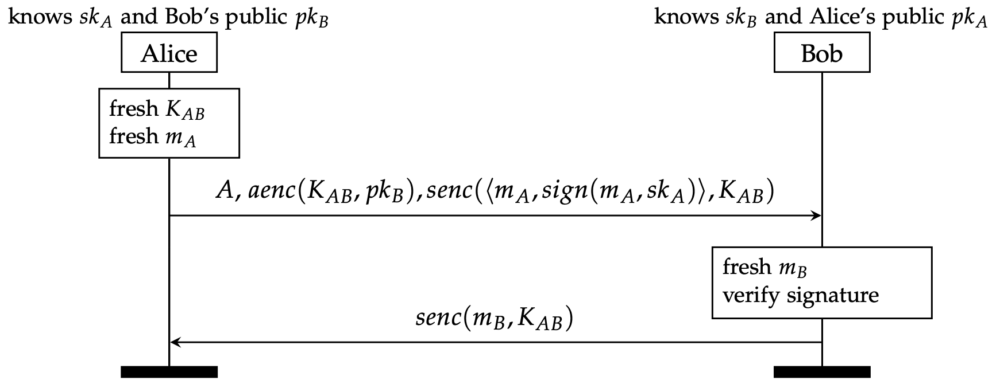

## Exercise 2.3: Leaking keys

The protocol of the previous task didn't achieve the security properties we wanted it to. In particular Bob had no guarantee Alice actually sent him the message. 

To fix this, we modify the protocol so that Alice signs the message she sends: 

#### Useful Tamarin built-ins

Tamarin already has a built-in theory `signing` for signature schemes. It defines the function symbols `sign/2`, `verify/3`, `pk/1`, and `true`, which are related by the equation `verify(sign(m,sk),m,pk(sk)) = true`. 

### Protocol Model

* Modify your previous model to include Alice's signature.  

* Verify both lemmas. This time Tamarin should verify `secrecyA` and `secrecyB`. Yay?

### Leaking keys

If you think carefully, this is unexpected: the protocol should be vulnerable to a man-in-the-middle attack that compromises the secrecy of _mB_!
Why is Tamarin not finding it?

Recall that while the adversary can use all the loaded function symbols (in this case `senc`, `sdec`, `aenc`, `adec`, `sign`, etc.), it cannot "execute" rules. 
In particular, it means that the adversary cannot generate a private/public key pair using our PKI rule. Hence, it cannot act as an agent!
This is quite a restrictive adversary model.

* To fix this, write a rule that allows an agent to be compromised: the rule should take an agents secret key and send it out in the network. In this way an adversary can use this key, "acting" like an agent. 

* Try to verify the secrecy lemmas. Tamarin should now disprove both. Look at the attack graphs. They will probably show either Alice and Bob themselves leaking a key! This is not a real attack: of course the messages _mA_ and _mB_ will not secret if either Alice or Bob themselves are compromised by the adversary. 
What we want to check is that the messages _mA_ and _mA_ remain secret _if both Alice and Bob are honest_. 

* In the rule that reveals an agent's secret key, add an action fact (e.g. `Compromised(..)`) that documents that a certain agent has been compromised. 
Fix your lemmas SecretA and SecretB to exclude the case of Alice and Bob themselves being compromised. 

* Run Tamarin again in interactive mode. Does it now find the expected man-in-the-middle-attack? 

* Observe how the reveal of keys has affected your executability lemma. Does the graph returned by Tamarin still correspond to the standard protocol run you would expect? If not, modify your executability lemma to exclude agents getting revealed. You should always make sure your protocol is executable if everyone is honest. 

