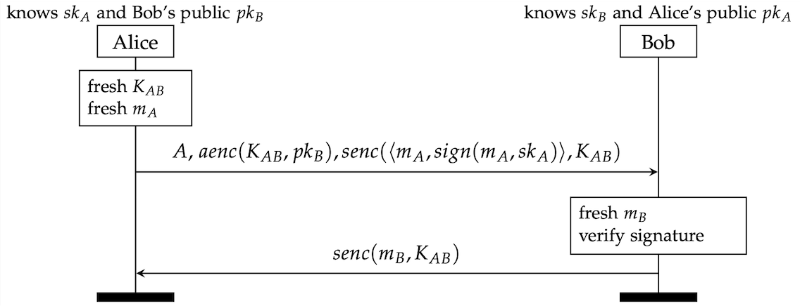

## Exercise 3.1

This exercise builts on top of exercise 2.3. You can use your own
solution of the exercise, or use the `Ex1.spthy` model in the `/models` folder.
Here's a reminder of how the protocol looks like:

### Security Properties: Authentication
The goal of this exercise is to familiarize yourself with _authentication_
properties. From the lecture, you already have some knowledge about the guarantess
these properties give, how to express
them, and that some of them are more _powerful_ than other. For more detailed
information, we refer to the [seminal paper](https://d1wqtxts1xzle7.cloudfront.net/32769013/download-libre.pdf?1391188461=&response-content-disposition=inline%3B+filename%3DA_Hierarchy_of_Authentication_Specificat.pdf&Expires=1716473894&Signature=ezDCbtcZHH25zHvd2xFgJgIiZ-l5B6kVlrryukF8-myHPgQBWt8f1dMZ2yqN1bX3c9Ywaq8YEzEI-aPazaXx6JcF9~vbQLb6-b6hdh8DolOw3dgUxM-K-YRK3TUESQV-cPwFOV4Le7Kk~W1~b7Jz9ipBu9AXvBv-xb~IY7gmiCUdHpTpoTcRL9tXUgEpaVHwlhcE4sVlu6WvuVSQ-5KYfDh5M5bxXVakJymLgij4l0ZHdLK4JoAK-z7EHfjLOFyU7eFqUGrO2hVC-2hN9gQLs4acMxS2zEZkP924QrbA34jAQVmSngNZNyRMgk0mhE2sHsLFDqAKHSjxMjxJ7E3D-A__&Key-Pair-Id=APKAJLOHF5GGSLRBV4ZA) ``A Hierarchy of Authentication Specifications''
by Gavin Lowe. There is no need to read to fully read the paper for this exercise,
inspecting Section 2 is enough.

Now think about whether you would expect some kind of authentication for Alice
or Bob. Does Bob get any guarantees related to Alice's identity and her
view of the protocol run? Does Alice get any guarantees related to Bob's
identity and his view of the protocol run?

### Tasks
* Start by writing an authentication lemma for Alice. Use the `FinishedA` and
`FinishedB` facts for this. Do you expect Alice and Bob to agree on each other's
identity? Do you expect them to agree on the messages? If you cannot prove
your lemma, use the interactive mode to inspect the counterexample. Is it a
_real_ attack? If not, what is the problem? Can you change your model to exclude
these attacks?

* Next, write an authentication lemma for Bob. Which action facts could you
use here? You might have to add new ones to your model. Can you prove that
Alice and Bob agree on the message? Can you prove that Alice and Bob
agree on their identities? If not, what is the problem? How would you change
the protocol to fix the problem?

* Now, we are going to revisit the authentication property that Alice gets.
Is this the _strongest_ authentication property you can state for Alice, or
can you strengthen the lemma? (Hint: The [Tamarin manual](https://tamarin-prover.com/manual/develop/tex/tamarin-manual.pdf) has a section
on property specification which can help you with the formulation of the property)