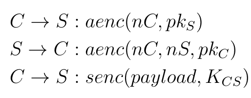

## Exercise 3.2 a

In this exercise, we are going to look into protocols that contain loops,
the problems this creates for Tamarin, and how we can solve them.
Consider the following protocol:

Here, a client $C$ and a server $S$ establish a symmetric session key
$K_{CS}$ by hashing the nonces $nC$ and $nS$ that they respectively chose, and
then the client uses this key to repeatedly send data towards the server.

In the `models` folder, you will find `Ex2_a.spthy` which contains
a spthy model of this protocol.

### Tasks
* Start by writing a lemma that establishes that the shared key is secret
when the client ends the protocol session, and try to prove it. If your
proof fails, inspect it in the interactive mode. What seems to be the
problem? Can Tamarin prove the lemma if you use induction? If no, why?
(Hint: Look at the induction hypothesis.)

* To avoid the looping behavior from the previous task, we will now specify
a _resuable_ intermediate lemma that Tamarin can use to finish the proof.
State a reusable lemma that establishes that a client sending a message must always
be preceded by the same client entering the `SESSION` state. Can you prove the
lemma? If not, can induction help us this time? If yes, why? What is the
difference compared to the previous task?

## Exercise 3.2 b

Now we are going to make a slight change to the protocol: The client
can send _pings_ towards the server which inform the server that
the session is still alive even though the client does not want to send
data right now.

This change is implemented in the file `Ex2_b.spthy` in the `models` folder. The
rules `Client_Send_Update` and `Server_Rcv_Update` implement this behavior.

### Tasks
* Do you expect your lemmas from the previous exercise to still prove? Why?
Finally, try to prove the lemmas again. Is the result what you expected?

* Unfortunately, the new rule that allows the client to ping
the server introduces another loop. Luckily, you've learned in the
previous exercise how to deal with loops. Write another lemma to deal with
this new loop, and try to prove it. If you can prove it, prove verify that your secrecy lemma verifies.
If your lemma is not proving continue with the next task.

* Depending on how you stated your previous lemmas, they might not be proving.
Inspect the failed proof in the GUI. What seems to be the problem? Can you
figure out a way to prove both lemmas? There is more than one solution here.