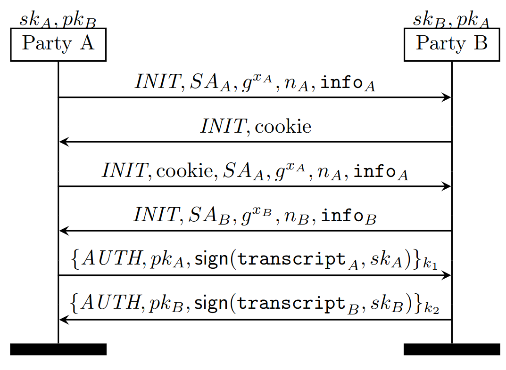

## Exercise 3.3

In this exercise, we are taking the trainings wheel off:
You are going to model the [IKEv2](https://datatracker.ietf.org/doc/html/rfc7296)
protocol on your own based off a description.
IKEv2 is a widespread Internet standard used by IPsec to secure traffic on IP
level. It is used for example in the more commonly known VPN.

In the figure below, you can see an outline of the protocol.

We will now give more information about the protocol.
In the following, $i$ is either $A$ or $B$, and the constants $INIT$ and $AUTH$ are
used to identify the role of each party. $SA_i$ and $info_i$ describe a set of
algorithms and meta information, respectively. The cookie is a random value to
identify the session later on. $g$ is a DH generator, and $x_A$ and $x_B$ are
the Diffie-Hellman shares of the two parties. $n_A$ and $n_B$ are random nonces.
For an integer $j$, the corresponding key $k_j$ is computed as follows:
$kdf (k, n_A, n_B , i)$. The transcript $transcript$ is computed by hashing
$SA_i, g^x_i , n_i, info_i$, and $MAC_i$. For $transcript_A$, the cookie is
also hashed, in front of the other values. The message authentication code
$MAC_i$is computed by `mac(pk_i, k_j)` where then initiator mac uses $j=3$ and the
responder mac $j=4$.

In the `models` folder, you will find `Ex3.spthy` which contains
a skeleton that you can use to start your model.

### Tasks

* Start off by modeling the generation of keys and identities.
Each identity should be able to act as both initiator and responder.

* Model the protocol as depicted in the Figure. To make it easier for you, restrict the
protocol such that parties do not start a key exchange with themselves,
and add a restriction that allows only one session of the protocol
per pair of peers.

* Prove sanity traces (via _exists_ lemmas) that prove that
each party can execute the protocol until the end.

* Think about authentication properties the parties get. Specify
properties that assert some kind of authentication over the
sent messages and the transcript. Feel free to strengthen your
properties until Tamarin finds a counterexample.

* Prove secrecy for all involved keys.

* Remove the restriction of a single session per pair of peers, and
adapt your lemmas to the new setting. Which lemmas no longer hold? Why?