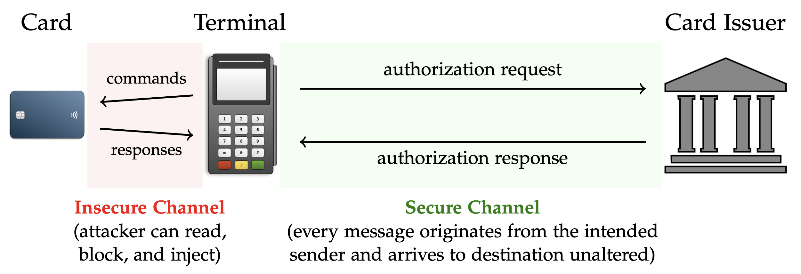
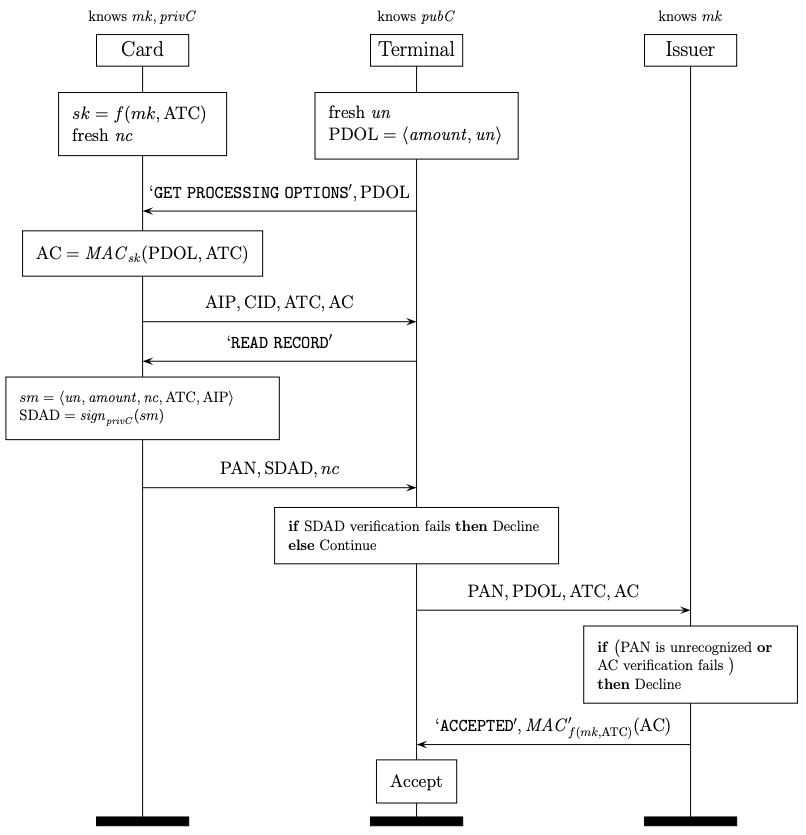

## The Visa contactless protocol

EMV, founded by companies Europay, Mastercard, and Visa (thus the name) is the international protocol standard for in-store smartcard payments. In this exercise we will develop a Tamarin security model and use it to perform a formal analysis of a simplified version of the EMV protocol for Visa contactless transactions.

#### Overview of EMV contactless payment

Cashless payment methods typically use devices like smartphones or smartwatches to transact with the payment terminals via Near Field Communication (NFC), a technology that allows for short-range wireless communication. In transactions using NFC, which are called contactless, the payment card (or the payment device) is held near the payment terminal and hence the two parties exchange messages called commands and responses. In this exercise we’ll regard them simply as messages.
In the EMV contactless transaction, after the card-terminal interaction is completed, the terminal continues with one of three options:

1. Decline offline,
2. Accept offline, or
3. Request Online Authorization.

If the transaction is accepted offline (i.e. second case), which occurs in some cases where the transaction amount is small or Internet connectivity is limited, the funds are not immediately transferred from the cardholder’s account to the merchant’s, but at the end of the day or even within a few days. If the transaction is otherwise required to be authorized by the card issuer (i.e. third case), which
is the most common scenario, then the terminal goes online, establishes a com- munication channel with the issuer, and sends the authorization request. Upon reception of the request, the card issuer undergoes a number of checks, such as that the cardholder’s account has sufficient funds for the amount requested and that the card-produced cryptographic proof for the transaction is correct. If everything checks out, the issuer sends back to the terminal the authorization response. 

Here is a graphical representation of the interaction between the card, the terminal, and the issuer in a contactless transaction.

The card-terminal interaction is determined by one of the six EMV contactless protocols (called kernels in EMV’s terminology), each of them corresponds to a dif- ferent card brand: Mastercard, Visa, American Express, JCB, Discover, and Union- Pay. As said before, we will focus on a simplified variation of the Visa protocol. The specifications of each of these kernels are available at [https://www.emvco.com](https://www.emvco.com), but you do not need to read them for this exercise!

### The (simplified) Visa protocol

This section provides technical background on the specific Visa contactless protocol. For the purpose of this exercises, some messages have been simplified and substantial parts of the protocol have been omitted, such as cardholder verification.  The crypto-related notation in the figure and also in the rest of this material is the following:

We will use this crypto-related notation in the following:
* _mk_ is a (master) key only known to the card and its issuer.
* _f_ is a key derivation function.
* _(privC, pubC)_ is the private/public key pair of the card. pubC is publicly known.
* _sign\_priv\_(m)_ is the digital signature on _m_ with the private key _priv_. Note that we consider signatures that do not reveal the message _m_.
* _verify(sig, m, pub)_ equals true if and only if _sig=sign\_priv\_(m)_ and _(priv, pub)_ is a valid private/public key pair.
* _MAC\_k\_(m)_ and _MAC′\_k\_(m)_ are Message Authentication Codes (MAC) on _m_ with the key _k_.

Here is an overview of the resulting execution flow of the Visa contactless transaction.

Let's look in detail at the steps of the protocol:

1. **Application Selection:** An EMV contactless transaction is performed using one of the six EMV contactless protocols/kernels mentioned before. The negotiation of the kernel to be used for the transaction is the first phase of the protocol. This negotiation is done via two exchanges of ‘SELECT′ commands and responses.
This brief description of the application selection phase is merely informative. We will not model this phase.

2. **Offline Data Authentication (ODA):** After a kernel has been selected (Visa in our case), the terminal sends the ‘GET PROCESSING OPTIONS′ command with the Processing Data Object List (PDOL) as the payload. The PDOL is composed
of the amount of the transaction and a terminal-generated random number un, called the Unpredictable Number (UN) in EMV’s terminology.
The card responds to this command with the Application Interchange Profile (AIP) and some other data that we will explain later in the Transaction Authorization phase. The AIP informs the terminal of the card’s authentication capabilities. In this lab we will assume that AIP = ‘fDDA′ and will explain later what this means.
The terminal then sends the ‘READ RECORD′ command to read the card’s records, which are static data stored in the card. We will assume these records are composed solely of the Primary Account Number (PAN, commonly known as the card number) and the nonce nc.
The terminal then proceeds to cryptographically authenticate the card, using the method indicated by the AIP. Our assumption on the AIP being ‘fDDA′ entails that the Fast Dynamic Data Authentication (fDDA) method will be used. In this method, the card replies to the terminal’s ‘READ RECORD′ command with the Signed Dynamic Authentication Data (SDAD), which is a signature by the
card on transaction data as indicated in the figure.

3. **Transaction Authorization (TA):** For transaction authorization, the card generates
and supplies the Application Cryptogram (AC) in response to the ‘GET PROCESSING OPTIONS′ command (note that this command goes before the ‘READ RECORD′ one). The AC is a cryptographic proof of the transaction. The computation by the card (and verification by the issuer) of the AC uses the session key _sk_ derived from a shared master key _mk_ and the ATC. The key _mk_ is only known to the issuer and the card.
 Together with the AC, the card sends the AIP (which we described before), the Cryptogram Information Data (CID), and the Application Transaction Counter (ATC). The CID, which can be ‘TC′ or ‘ARQC′, indicates the type of authorization: offline or online, respectively.
The transaction continues as follows:
    * if CID = ‘TC′, then the transaction is approved offline by the terminal. In this case, the AC is called the Transaction Cryptogram (TC).

    * otherwise (i.e. if CID = ‘ARQC′) the terminal forwards the transaction data to the issuer for online authorization. The data forwarded is composed of the card number (i.e. the PAN), the PDOL, the transaction counter ATC, and the Application Cryptogram (AC). In this case, the AC is called the Authorization Request Cryptogram (ARQC). 
  The issuer authorizes the transaction if the AC is correct, in which case it sends back to the terminal the authorization code ‘ACCEPT′ and an issuer-generated MAC, called the Authorization Response Cryptogram (ARPC). The ARPC serves, among other things, as a cryptographic proof for the terminal that the issuer accepted the transaction.

Notice that the terminal can neither verify the AC nor the ARPC because the key _mk_, and _sk_ by extension, are unknown to it.

#### Task

Model the above protocol. Recall that we assume a secure channel between the terminal and the issuer.
Also remember to write some executability lemmas to make sure your model makes sense. 

### Authentication properties

Consider the following three authentication properties.

1. All transactions accepted offline by the terminal are authenticated to it by the card. 

2. All online-authorized transactions accepted by the terminal are authenticated to it by both the card and the issuer. 

3. All transactions accepted by the issuer are authenticated to it by both the card and the terminal.

Write lemmas describing these properties and try to verify/disprove them.